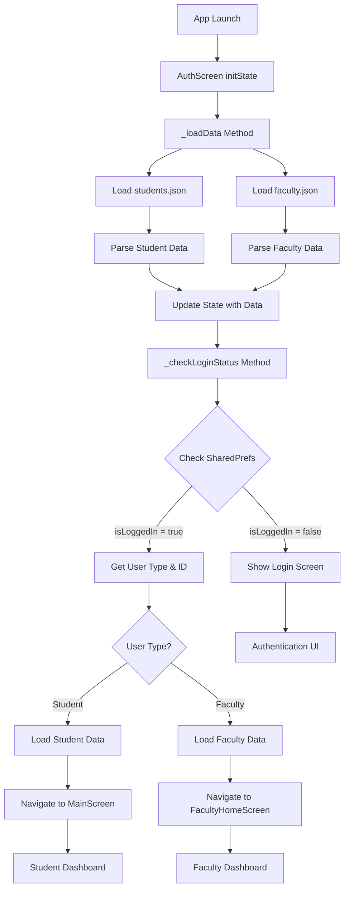
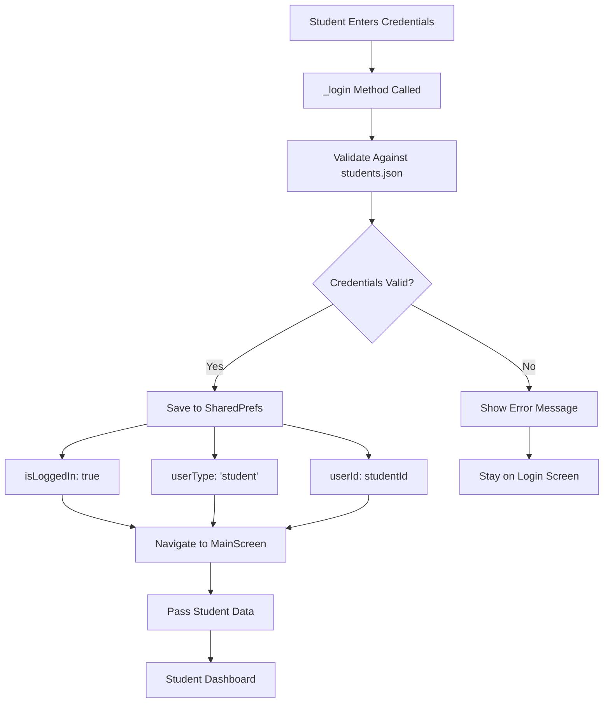
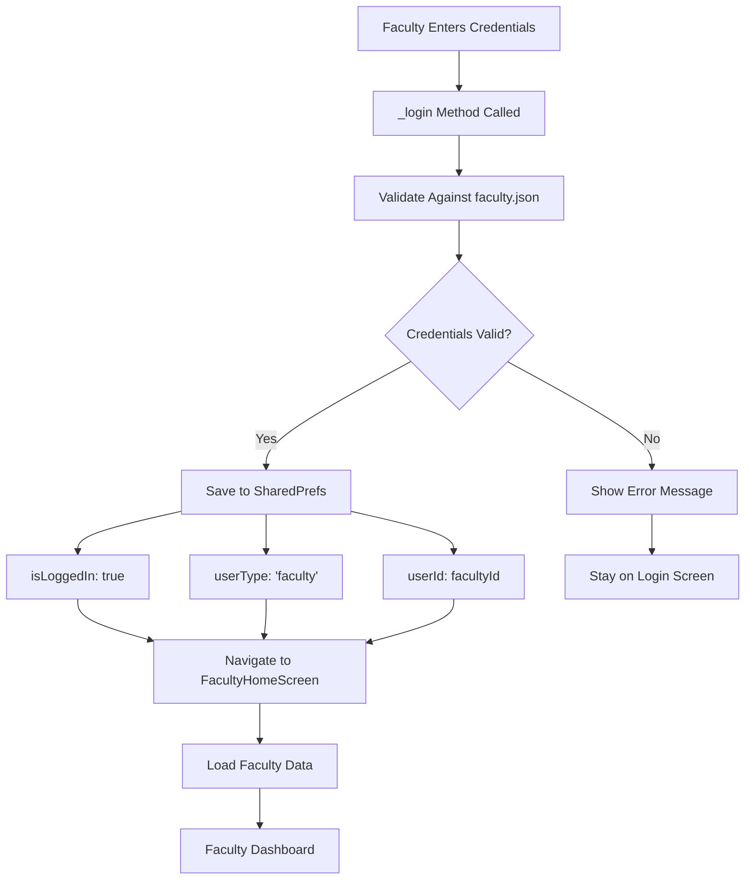
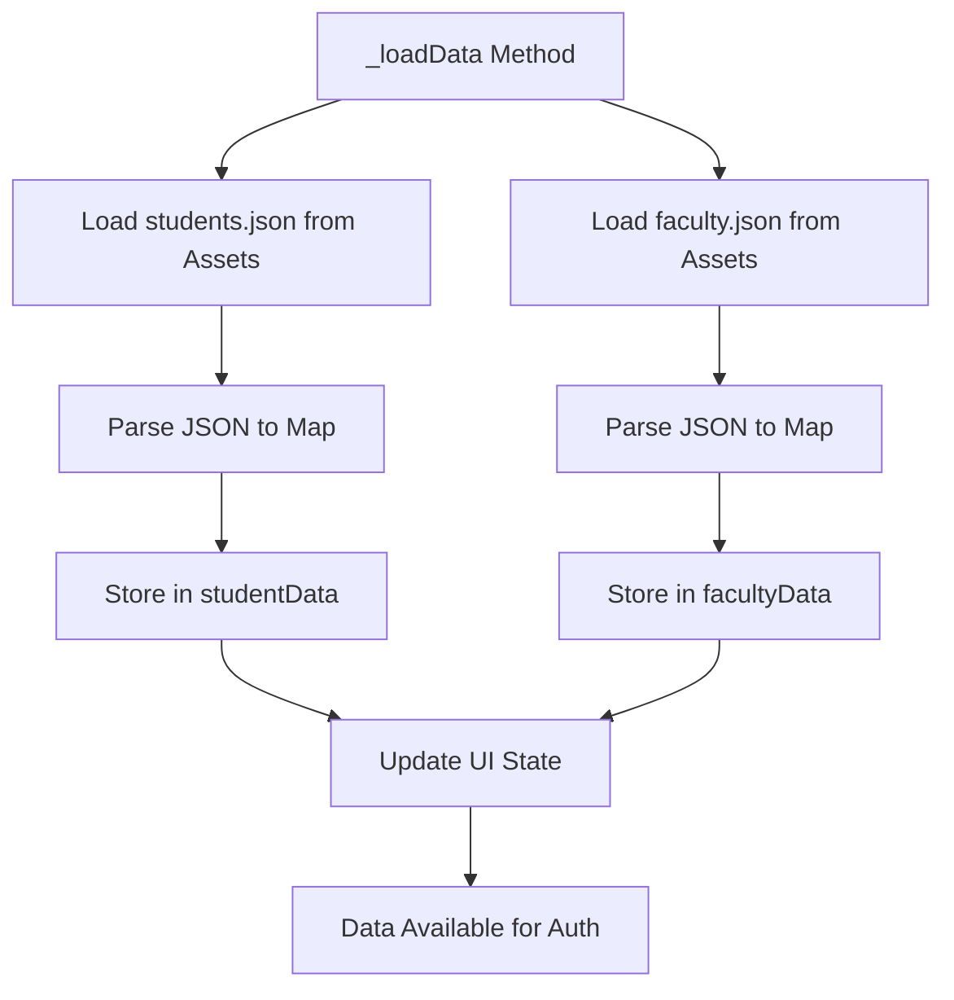
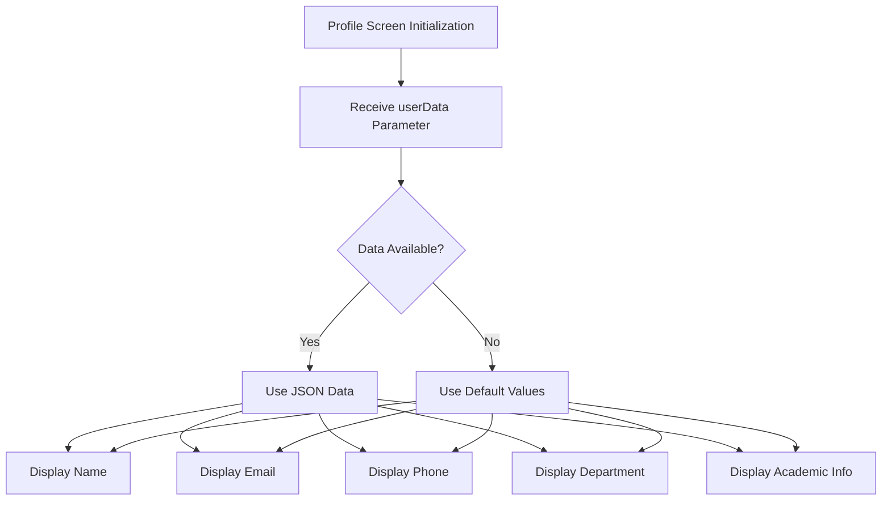
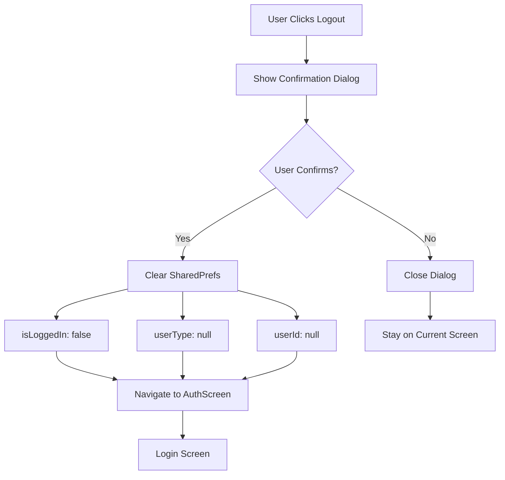

# Authentication System Documentation

## Overview
This document outlines the complete authentication workflow for the Attendance Tracker application, including JSON-based data management, shared preferences integration, and user session persistence.

## System Architecture

### Data Storage
- **JSON Files**: User credentials and profile data stored in `assets/json/`
  - `students.json`: Student authentication and profile data
  - `faculty.json`: Faculty authentication and profile data
- **Shared Preferences**: Session persistence and user state management
- **Flutter Assets**: JSON files bundled with the application

### Key Components
1. **AuthScreen**: Login interface and authentication logic
2. **MainScreen**: Student navigation hub with data passing
3. **FacultyHomeScreen**: Faculty navigation hub with data loading
4. **Profile Screens**: Dynamic profile data display

## Authentication Workflows

### 1. Application Startup Flow



### 2. Student Login Flow



### 3. Faculty Login Flow



### 4. Data Loading Flow



### 5. Profile Data Display Flow



### 6. Logout Flow



## JSON Data Structure

### Students JSON Format
```json
{
  "STUDENT_ID": {
    "password": "password",
    "name": "Full Name",
    "email": "email@domain.com",
    "phone": "+91 XXXXX XXXXX",
    "dateOfBirth": "DD/MM/YYYY",
    "address": "City, State",
    "department": "Department Name",
    "year": "Year",
    "division": "Division",
    "rollNumber": "Roll Number",
    "sgpa": "SGPA"
  }
}
```

### Faculty JSON Format
```json
{
  "FACULTY_ID": {
    "password": "password",
    "name": "Full Name",
    "email": "email@domain.com",
    "phone": "+91 XXXXX XXXXX",
    "department": "Department Name",
    "designation": "Designation"
  }
}
```

## Shared Preferences Schema

### Stored Values
- **isLoggedIn** (Boolean): Authentication status
- **userType** (String): 'student' or 'faculty'
- **userId** (String): Student/Faculty ID for data retrieval

### Usage Patterns
```dart
// Save login state
await prefs.setBool('isLoggedIn', true);
await prefs.setString('userType', 'student');
await prefs.setString('userId', 'FCUG23749');

// Retrieve login state
final isLoggedIn = prefs.getBool('isLoggedIn') ?? false;
final userType = prefs.getString('userType') ?? '';
final userId = prefs.getString('userId') ?? '';

// Clear all data on logout
await prefs.clear();
```

## Error Handling

### Authentication Errors
- Invalid credentials → Show error message
- Network issues → Handle gracefully
- JSON parsing errors → Log and use defaults

### Data Loading Errors
- Missing JSON files → Log error and continue
- Invalid JSON format → Handle parsing exceptions
- Asset loading failures → Provide fallback data

## Security Considerations

### Current Implementation
- Passwords stored in plain text in JSON (development only)
- Session persistence via shared preferences
- No encryption for stored data

### Production Recommendations
- Hash passwords in JSON files
- Implement token-based authentication
- Add session timeout functionality
- Encrypt sensitive data in shared preferences

## Testing Scenarios

### Positive Test Cases
1. Valid student credentials → Successful login
2. Valid faculty credentials → Successful login
3. Session persistence → Auto-login on app restart
4. Logout → Clear session and return to login
5. Profile data display → Correct information shown

### Negative Test Cases
1. Invalid credentials → Error message
2. Empty credentials → Validation error
3. Network issues → Graceful handling
4. Corrupted JSON → Fallback to defaults
5. Missing data fields → Default values used

## Performance Optimizations

### Data Loading
- JSON files loaded once at app start
- Data cached in memory for quick access
- Asynchronous loading prevents UI blocking

### Session Management
- Shared preferences for fast session checks
- Minimal data storage for quick retrieval
- Efficient state updates

## Future Enhancements

### Authentication
- Biometric authentication integration
- Two-factor authentication
- OAuth integration
- Password reset functionality

### Data Management
- Remote data synchronization
- Offline data caching
- Real-time updates
- Data validation

### Security
- End-to-end encryption
- Secure token management
- Session timeout
- Audit logging

## Troubleshooting

### Common Issues
1. **Login not persisting**: Check shared preferences timing
2. **Data not loading**: Verify JSON file paths
3. **Profile showing defaults**: Check data parameter passing
4. **Logout not working**: Verify shared preferences clearing

### Debug Steps
1. Check console logs for errors
2. Verify JSON file structure
3. Test shared preferences operations
4. Validate data flow between screens

## Conclusion

This authentication system provides a robust foundation for user management with:
- Secure credential validation
- Persistent session management
- Dynamic profile data display
- Clean separation of concerns
- Scalable data structure

The system is designed for easy maintenance and future enhancements while maintaining security and performance standards.
